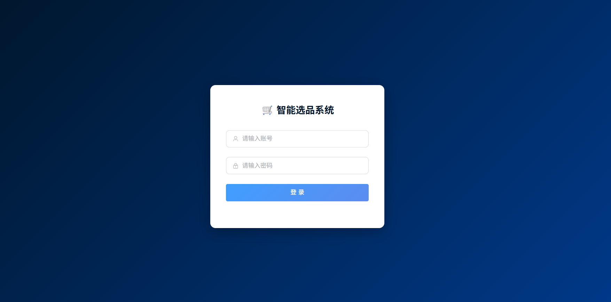
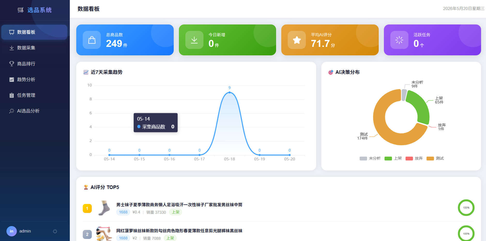
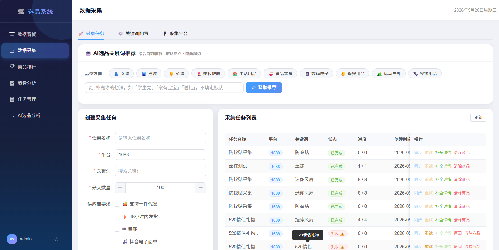
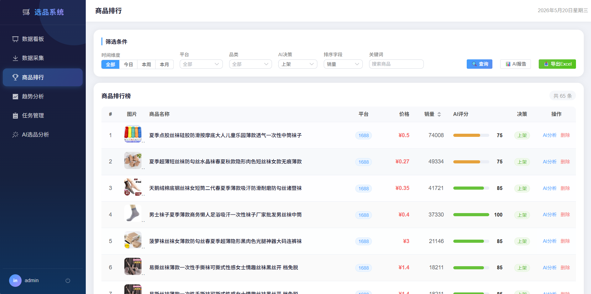
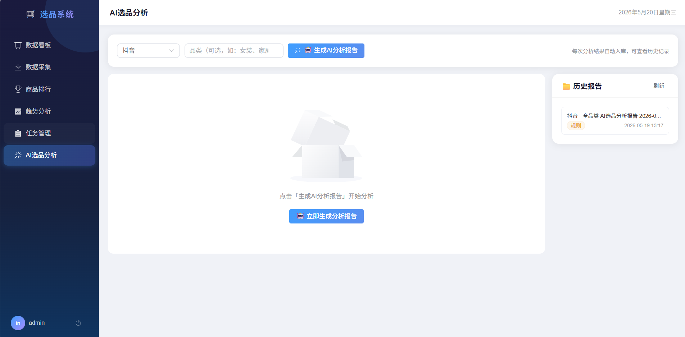

# 选品系统 Product Select System

> 面向**抖音店铺**的智能选品与运营分析平台，基于 **Spring Boot 2.7 + Vue 3 + MyBatis-Plus + Redis** 构建，集成 **1688 原生接口**数据采集与 DeepSeek AI 深度分析。

---

## 系统截图

### 登录页


### 主界面


### 功能截图







---

## 目录结构

```
product-select-system/
├── backend/                    # Spring Boot 后端 (端口 8080)
│   ├── src/main/java/          # 业务代码（controller/service/mapper/entity/dto）
│   ├── src/main/resources/     # 配置文件、SQL、MyBatis XML
│   └── Dockerfile
├── frontend/                   # Vue 3 前端 (开发端口 3000 / 生产端口 80)
│   ├── src/
│   │   ├── views/              # 页面组件
│   │   ├── api/                # Axios 接口封装
│   │   ├── stores/             # Pinia 状态管理
│   │   └── router/             # 路由配置
│   └── Dockerfile
├── docker-compose.yml
└── README.md
```

---

## 功能模块

| 模块 | 路由 | 说明 |
|------|------|------|
| 数据看板 | `/dashboard` | 总商品数、平均 AI 评分、采集统计、TOP5 热门商品卡片 |
| 数据采集 | `/collect` | 创建 / 执行 / 重试采集任务，支持 **1688 原生接口**关键词采集，实时轮询进度 |
| 商品排行 | `/ranking` | 多维度排序（销量 / 评分 / AI 评分），支持关键词筛选与分页 |
| 趋势分析 | `/trend` | 单商品销量/价格历史趋势折线图（ECharts） |
| 任务管理 | `/task` | 商品列表，支持单个 / 批量触发 AI 分析，查看分析进度 |
| **AI 分类分析** | `/ai-analysis` | 热门分类分析、即将热门分类预测、分类选品推荐（抖音方向） |
| **商品 AI 分析** | `/ai-analysis` | 商品深度分析：上架建议、推广策略、抖音营销全流程及推广手段 |
| **分析报告** | `/ai-analysis` | 历史分析报告列表，分块展示（分类概览 / 商品推荐 / 推广方案），支持入库持久化 |

---

## 数据采集说明

系统通过调用 **1688 开放平台原生接口**直接拉取商品数据，无需第三方中间服务。

### 采集流程

```
关键词配置 → 调用 1688 商品搜索接口 → 解析商品详情/销量/评价 → 入库 product 表 → 触发 AI 分析
```

### 涉及的 1688 主要接口

| 接口 | 用途 |
|------|------|
| `alibaba.product.search` | 按关键词搜索商品列表 |
| `alibaba.product.get` | 获取商品详情（标题 / 价格 / 规格 / 主图） |
| `alibaba.trade.order.list` | 辅助估算销量趋势 |
| `alibaba.category.list` | 获取分类树，用于分类分析 |

### 授权方式

1688 接口采用 **OAuth 2.0** 授权体系：

1. 在 [open.1688.com](https://open.1688.com) 创建应用，获取 `AppKey` / `AppSecret`
2. 引导用户完成 OAuth 授权，获取 `AccessToken`（有效期约 7 天）及 `RefreshToken`
3. 系统内置自动续期逻辑：`AccessToken` 过期前通过 `RefreshToken` 静默刷新，保障采集不中断

### 配置存储方式

> 📦 **1688 接口凭证与采集任务配置均存储在数据库中**，无需写入 `application.yml`。
>
> 在系统前端「配置管理」页面填写以下信息后保存即可，系统运行时从数据库动态读取：
>
> | 配置项 | 说明 |
> |--------|------|
> | `app_key` | 1688 开放平台 AppKey |
> | `app_secret` | 1688 开放平台 AppSecret |
> | `access_token` | OAuth 2.0 授权 AccessToken（系统自动续期） |
> | `refresh_token` | OAuth 2.0 RefreshToken |
> | `keyword` | 采集关键词（支持多条，存储于 `keyword_config` 表） |
> | `page_size` | 每次采集商品数量 |
> | `collect_interval` | 定时采集间隔（分钟） |

---

## AI 分析功能详解

### 分类分析
- **当前热门分类**：基于近期销量、增长率对全量分类打分排序，输出 TOP N 热门分类。
- **即将热门分类**：结合时间趋势与季节性预测，提前识别潜力分类。
- **分类选品推荐**：针对每个分类，由 DeepSeek AI 推荐最具潜力的商品方向及关键词。

### 商品 AI 分析
- **上架建议**：标题优化、定价策略、SKU 组合建议。
- **推广分析**：竞争度、CPM 预估、投产比分析。
- **抖音营销推广流程**：
  - 短视频内容脚本建议（钩子 → 卖点展示 → CTA）
  - 直播间话术与节奏安排
  - 达人投放策略（腰部/头部/素人矩阵）
  - DOU+ / 千川投放计划
  - 私域沉淀与复购运营

### 分析报告
- 每次分析结果自动入库（`ai_category_report` 表）。
- 前端分块展示：分类概览卡片、商品推荐列表、推广方案详情。
- 支持按日期筛选历史报告，可对比不同时期分析结论。

---

## 快速启动

### 方式一：Docker Compose（推荐）

```bash
# 配置 DeepSeek API Key
# Windows PowerShell
$env:DEEPSEEK_API_KEY="your_deepseek_api_key"

docker-compose up -d
```

访问：http://localhost

### 方式二：本地开发

**环境要求：** JDK 11+、Maven 3.8+、Node.js 18+、MySQL 8、Redis 6+

**后端：**
```bash
cd backend
# 先执行数据库初始化
mysql -u root -p < src/main/resources/init.sql
mvn spring-boot:run
# 接口文档：http://localhost:8080/doc.html
```

**前端：**
```bash
cd frontend
npm install
npm run dev
# 访问 http://localhost:3000
```

---

## 配置说明

编辑 `backend/src/main/resources/application.yml`：

```yaml
spring:
  datasource:
    url: jdbc:mysql://localhost:3306/product_select?useUnicode=true&characterEncoding=utf8&serverTimezone=Asia/Shanghai
    username: root          # MySQL 用户名
    password: your_password # MySQL 密码
  redis:
    host: localhost
    port: 6379
    password:               # Redis 密码，未设置密码则留空
    database: 0             # 使用的 Redis 数据库编号，默认 0

deepseek:
  api:
    key: 你的 DeepSeek API Key        # DeepSeek AI 接口密钥（在 platform.deepseek.com 获取）
    url: https://api.deepseek.com/v1  # 可替换为兼容 OpenAI 格式的其他 LLM 地址
```

> 💡 **1688 接口凭证（AppKey / AppSecret / AccessToken 等）及采集关键词、采集频率等配置均通过前端页面录入，存储在数据库中，无需在此文件配置。**

### 各账号/密钥获取方式

| 配置项 | 获取方式 |
|--------|---------|
| MySQL `username` / `password` | 本地安装时自行设置；Docker 部署时见 `docker-compose.yml` 中 `MYSQL_ROOT_PASSWORD` 环境变量 |
| Redis `password` | 本地未设置密码可留空；Docker 部署时见 `docker-compose.yml` 中 `REDIS_PASSWORD` 环境变量 |
| 1688 `AppKey` / `AppSecret` / `AccessToken` | 登录 [https://open.1688.com](https://open.1688.com) 获取后，在系统前端「配置管理」页面填写保存 |
| `deepseek.api.key` | 登录 [https://platform.deepseek.com](https://platform.deepseek.com) → API Keys → 创建并复制密钥 |

> ⚠️ **安全提示**：请勿将含有真实密钥的 `application.yml` 提交到公开仓库。建议通过环境变量注入敏感配置：
>
> ```yaml
> deepseek:
>   api:
>     key: ${DEEPSEEK_API_KEY}
> spring:
>   datasource:
>     password: ${DB_PASSWORD}
> ```

---

## 数据库初始化

```bash
# 执行建库建表 SQL（全新安装 & 旧库升级均使用同一个文件）
mysql -u root -p < backend/src/main/resources/init.sql
```

> 💡 `init.sql` 已合并所有历史变更，末尾内置 `upgrade_schema` 存储过程，可安全重复执行（列已存在时自动跳过）。

主要数据表：

| 表名 | 说明 |
|------|------|
| `product` | 商品基础信息 |
| `ranking_history` | 商品排名历史 |
| `keyword_config` | 采集关键词配置 |
| `collect_task` | 采集任务记录 |
| `daily_stats` | 每日统计数据 |
| `ai_category_report` | AI 分类分析报告（含商品推荐与推广方案） |

---

## 技术栈

| 层次 | 技术 |
|------|------|
| 后端框架 | Spring Boot 2.7 · Spring MVC · Spring Cache |
| 持久层 | MyBatis-Plus · MySQL 8 |
| 缓存 | Redis 6 (Lettuce) |
| AI 接入 | DeepSeek API (OpenAI 兼容格式) |
| 爬虫采集 | 1688 开放平台原生接口 (OAuth 2.0) |
| 工具库 | Hutool · FastJSON · Lombok |
| 接口文档 | Knife4j (Swagger 3) |
| 前端框架 | Vue 3 (Composition API) · Vite 4 |
| UI 组件 | Element Plus |
| 图表 | ECharts 5 |
| 状态管理 | Pinia |
| HTTP 客户端 | Axios |
| 部署 | Docker · Docker Compose · Nginx |

---

## 接口文档

启动后端后访问：[http://localhost:8080/doc.html](http://localhost:8080/doc.html)

---

## License

本项目基于 [MIT License](./LICENSE) 开源协议发布。

[](https://opensource.org/licenses/MIT)

- 允许自由使用、复制、修改、合并、发布、分发、再授权及销售本软件。
- 使用时须保留原始版权声明及 MIT 许可声明。
- 本软件按"原样"提供，不附带任何明示或暗示的担保。
